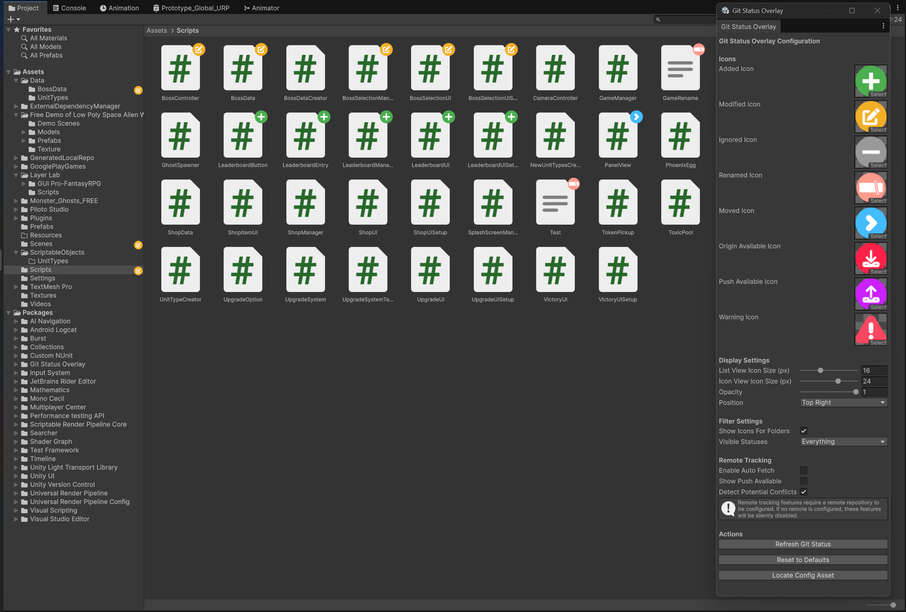

# Git Status Overlay for Unity

**Git Status Overlay** is a Unity Editor extension that displays Git status icons directly in the Project window, helping you visualize which assets are modified, added, ignored, or renamed in your repository.



## Features

- Shows overlay icons for:
  - Added (untracked) files
  - Modified files
  - Renamed/moved files
  - Ignored files
  - Files with changes available in remote
  - Files with local commits ready to push
  - Warning for potential conflicts (modified locally and in remote)
  - Folders (optional)
- Multiple icons can be displayed on the same file when applicable
- Configurable icon, size, opacity, and position
- Optional automatic fetching from remote repository
- Configurable fetch interval
- Editor window for easy configuration

## Security

This package does not perform any direct Git operations that could modify your repository. 
It only reads information from Git to display the current status of your files.
- No Pull
- No Push
- No Commit
- ...
The only interaction is a Fetch to check for remote changes, along with reading the output of git status.
This ensures the extension is safe to use and non-intrusive, as it merely provides a visual overlay of your repository’s state.

## Installation

1. **Via Unity Package Manager (UPM):**

   - Open the Package Manager window (`Window > Package Manager`).
   - Click the **Add (+)** button in the toolbar.
   - Select **Install package from git URL**.
   - Enter the following URL:
     ```
     https://github.com/NoFrosty/gitstatusoverlay.git
     ```
   - Click **Install**.

   Alternatively, you can add the following to your `manifest.json`:

   ```json
   "com.caesiumgames.gitstatusoverlay": "https://github.com/NoFrosty/gitstatusoverlay.git"
   ```

2. **Manual:**
   - Download or clone this repository.
   - Place the folder in your project's `Packages` directory.

## Usage

1. **The package automatically loads the default configuration:**

   - On first import, the package uses the default config located at `.../com.caesiumgames.gitstatusoverlay/Editor/Data/GitStatusOverlayConfig.asset`
   - You can customize settings directly in this file, or create a user override (see below)

2. **Open the configuration window:**

   - Go to `Window > Git Status Overlay`.

3. **Configure icons and options:**

   - Assign your preferred icons for each status.
   - Adjust icon sizes for list view and icon view separately.
   - Configure icon opacity and position.
   - Toggle folder overlays and status types.

4. **Configure remote tracking (optional):**

   - Enable auto-fetch to periodically check for remote changes.
   - Set the fetch interval (in seconds).
   - Enable "Show Push Available" to see files with unpushed commits.
   - Enable "Detect Potential Conflicts" to warn about files modified both locally and remotely.

5. **Create a user config override (optional):**

   - If you want to create a project-specific configuration that won't be affected by package updates, create a new `GitStatusOverlayConfig` asset in your Assets folder.
   - The system will automatically prioritize Assets-based configs over the package default.

6. **Refresh Git status:**
   - Click "Refresh Git Status" in the window to update overlays by forcing the refresh.

## Requirements

- Unity 6000.0 or newer (recommended)
- Git must be installed and available in your system PATH

## Customization

- You can use your own icons by assigning them in the config window.
- The overlay supports most common Git statuses (see `GitStatus` enum for details).
- Multiple icons will be displayed side-by-side when a file has multiple statuses.
- **Separate icon sizes**: The package automatically detects Unity's Project window view mode:
  - **List View** (files shown as lines): Uses `Icon Size List View` setting (8-32px, default 16px)
  - **Icon View** (files shown with large previews): Uses `Icon Size Icon View` setting (8-64px, default 24px)
  - You can customize each size independently to perfectly fit your workflow.

## Troubleshooting

- If icons do not appear, ensure your config asset is created and assigned.
- Make sure Git is installed and accessible from the command line.
- Only files inside the `Assets/` folder are tracked for overlays.
- Make sure your project is using Git.
- Auto-fetch requires a valid remote repository connection and is by default disable.

## Icons Attribution

The following icons from Flaticon are used in this project. Colors may have been modified for better visibility and integration with Unity's interface:

- [Plus icons created by kliwir art - Flaticon](https://www.flaticon.com/free-icons/plus)
- [Modify icons created by riajulislam - Flaticon](https://www.flaticon.com/free-icons/modify)
- [Minus icons created by Alfredo Hernandez - Flaticon](https://www.flaticon.com/free-icons/minus)
- [Next icons created by riajulislam - Flaticon](https://www.flaticon.com/free-icons/next)
- [Rename icons created by afif fudin - Flaticon](https://www.flaticon.com/free-icons/rename)
- [Save file icons created by Fathema Khanom - Flaticon](https://www.flaticon.com/free-icons/save-file)
- [Publish icons created by Fathema Khanom - Flaticon](https://www.flaticon.com/free-icons/publish)
- [Alert icons created by riajulislam - Flaticon](https://www.flaticon.com/free-icons/alert)

## License

This project is licensed under the MIT License - see the [LICENSE](LICENSE) file for details.

## Credits

[](https://calvindogus.dev)
[](https://caesiumgames.com)

---

**For issues or contributions, please open a pull request or issue on GitHub.**
